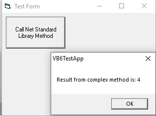
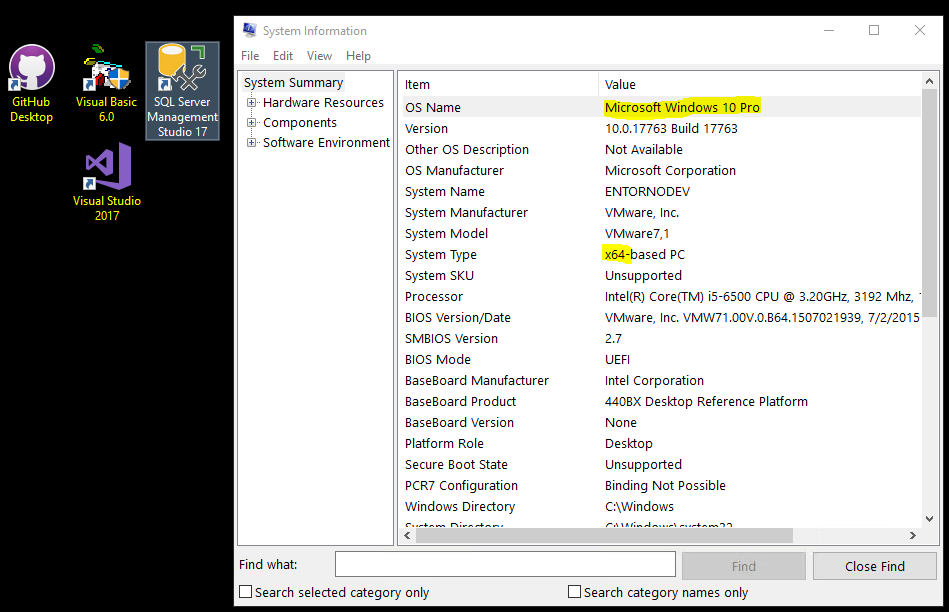

# VB6 and .NET Standard Class Library Interop
This sample shows how to call methods in a .NET Standard 2.0 class library from a Visual Basic 6 application. You can also use Full .NET Framework (4.7.2 or other versions) for your class libraries and it will make no difference.

### Step 1 - Create .NET Standard Class Library

* Create an interface for the methods you need to use from VB6 and make it visible to COM

```csharp
[Guid("45f838c9-d8cd-4198-b2b3-f4e8c2a5b588")]
[ComVisible(true)]
public interface IMathUtils
{
    double CalculateComplexMethod();
    void CommandWithParameters(int number1, int number2);
}
```

> Guid must be unique for this interface

* Implement the interface in a class and also make it visible to COM. Don't use the Guid as the interface

```csharp
[Guid("293bcd3a-e771-45d5-8a53-5413997c2de8")]
[ComVisible(true)]
[ProgId("NetStandardLibrary.MathUtils")]
public class MathUtils : IMathUtils
{
    // For COM interop we need parameterless constructor
    public MathUtils() { }

    public double CalculateComplexMethod() => 2 * 2;

    public void CommandWithParameters(int number1, int number2)
    {
        // Do something in here like saving to a JSON file, POST to some REST API or anything
        // without needing to code in prehistoric VB6
    }
}
```

* Compile library, generate tlb from assembly and register tlb and dll in development. Use Developer Command Prompt for Visual Studio as Administrator

```dos
regasm.exe /tlb /codebase NetStandardLibrary.dll
```

> Microsoft .NET Framework Assembly Registration Utility version 4.7.3190.0
> for Microsoft .NET Framework version 4.7.3190.0
> Copyright (C) Microsoft Corporation.  All rights reserved.
> 
> RegAsm : warning RA0000 : Registering an unsigned assembly with /codebase can cause your assembly to interfere with other applications that may be installed on the same computer. The /codebase switch is intended to be used only with signed assemblies. Please give your assembly a strong name and re-register it.
> Types registered successfully
> Assembly exported to '[Path]\NetStandardLibrary\bin\Release\netstandard2.0\NetStandardLibrary.tlb', and the type library was registered successfully
> 

### Step 2 - Add reference to library tlb from VB6

* Open your VB6 application and browse NetStandardLibrary.tlb from Project -> References

> This will add the reference to project .vbp file  
> Reference=*\G{A1A932E1-98D8-38DE-81F5-6B67BC4AF161}#1.0#0#..\NetStandardLibrary\bin\Release\netstandard2.0\NetStandardLibrary.tlb#NetStandardLibrary
> 

### Step 3 - Run methods from library

```vbnet
Dim oMathMethods As IMathUtils
Set oMathMethods = New NetStandardLibrary.MathUtils

MsgBox ("Result from complex method is: " & oMathMethods.CalculateComplexMethod())
```

### Step 4 - Success

* You can now extend your old VB6 application and keep your customer's and yourself happy writing as little as possible code in VB6 and avoiding Visual Studio 6 IDE



### Step 5 - Deployment in client computers

* Add the NetStandard dll file of your library to your installer
* No need to deploy tlb file
* This dll will not register with regsvr32.exe your will need to use regasm.exe. Use 32 or 64bit version depending on your needs.
* Register with /codebase argument
* Unregister with /unregister argument
* To locate regasm.exe in client computer you can find the related registry keys in HKLM\Software\Microsoft\.NetFramework. For example: C:\Windows\Microsoft.NET\Framework64\v4.0.30319 for 64bits or  C:\Windows\Microsoft.NET\Framework\v4.0.30319 for 32bits

### Extras
##### VB6 in Github

In order to use Github for your VB6 source code add this extensions to your Visual Studio .gitignore file. Like in this project [.gitignore file for VB6](.gitignore)

```markdown
*.csi
*.exp
*.lib
*.lvw
*.dca
```

##### VB6 running on Windows 10 x64bits

Here are a few links to help you setup VB6 in Windows 10.

http://blog.danbrust.net/2015/09/14/installing-visual-basic-studio-6-on-windows-10

https://blogs.msdn.microsoft.com/luisdem/2018/12/03/how-to-install-visual-basic-6-0-on-windows-10/



##### VB6 deployment in client computers using NSIS

* If you use NSIS for your deployment this macros and functions will help you.

```
; Given a .NET version number, this function returns that .NET framework's
; install directory. Returns "" if the given .NET version is not installed.
; Params: [version] (eg. "v2.0")
; Return: [dir] (eg. "C:\WINNT\Microsoft.NET\Framework\v2.0.50727")
Function GetDotNetDir
	Exch $R0 ; Set R0 to .net version major
	Push $R1
	Push $R2
 
	; set R1 to minor version number of the installed .NET runtime
	ClearErrors
	EnumRegValue $R1 HKLM "Software\Microsoft\.NetFramework\policy\$R0" 0
	IfErrors getdotnetdir_err
 
	; set R2 to .NET install dir root
	ReadRegStr $R2 HKLM "Software\Microsoft\.NetFramework" "InstallRoot"
	IfErrors getdotnetdir_err
 
	; set R0 to the .NET install dir full
	StrCpy $R0 "$R2$R0.$R1"
 
getdotnetdir_end:
	Pop $R2
	Pop $R1
	Exch $R0 ; return .net install dir full
	Return
 
getdotnetdir_err:
	StrCpy $R0 ""
	Goto getdotnetdir_end
FunctionEnd

!macro RegAsm DllFileName
; get directory of .NET framework installation
	Push "v4.0"
	Call GetDotNetDir
	Pop $R0

	; Perform our install
	; e.g. use the .Net path in $R0 to call RegAsm.exe
	;TODO: User nsExec to avoid black window
	ExecWait '"$R0\RegAsm.exe" /codebase "${DllFileName}"'
!macroend
```
